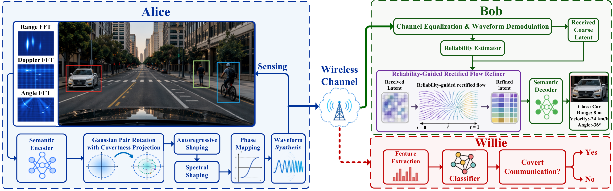
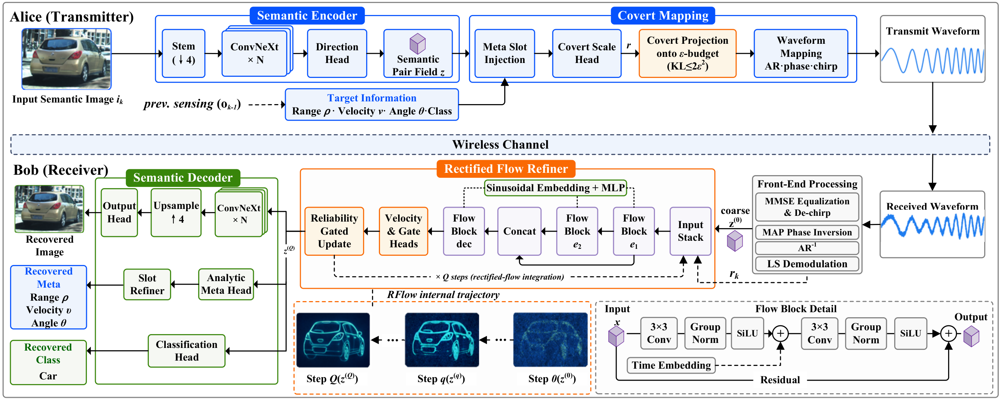

<h1 align="center">CoSMIC: Hiding Semantics in ISAC</h1>

<h3 align="center">Covert Communication over Dual-Functional Waveforms<br>with Rectified Flow-Assisted Recovery</h3>

<p align="center">
  <a href="https://arxiv.org/abs/2607.25354">
    
  </a>
  
  
  
</p>

<p align="center">
  <a href="https://arxiv.org/abs/2607.25354">Paper</a> •
  <a href="#overview">Overview</a> •
  <a href="#system-model">System Model</a> •
  <a href="#cosmic-network">CoSMIC Network</a> •
  <a href="#demo">Demo</a> •
  <a href="#getting-started">Getting Started</a> •
  <a href="#citation">Citation</a>
</p>

Official implementation of the paper
[**“Covert Semantic Transmission in ISAC: Dual-Functional Waveform Design and Rectified Flow-Assisted Recovery”**](https://arxiv.org/abs/2607.25354).

---

## Overview

Semantic transmission over integrated sensing and communication (ISAC) is a promising paradigm for efficient and intelligent connectivity in future wireless networks. However, the open nature of the wireless channel exposes the dual-functional waveform to warden detection, which makes the *joint* guarantee of **covertness**, **sensing fidelity**, and **semantic accuracy** a fundamental challenge.

**CoSMIC** (**C**vertness-**o**riented **S**emantic **M**odulation in **I**SAC **C**hirps) hides an entire semantic transmission inside an ordinary sensing waveform: the sensing output of each frame is embedded into the next frame's dual-functional chirp through semantic modulation, so that the radiated signal remains statistically indistinguishable from a sensing-only probe. The framework consists of:

- **Semantic rotation coding** — semantic latents are mapped onto the pairwise *rotation* and *scaling* of shared Gaussian reference sequences, keeping the transmit waveform constant-modulus in both modes.
- **Closed-form covertness guarantee** — a derived per-frame Kullback–Leibler bound is enforced *by construction* through a differentiable budget projection, valid against arbitrary detectors including learning-based ones.
- **Sensing performance preservation** — the radar performance under semantic embedding is analyzed in the paper.
- **Reliability-guided rectified flow (RFlow) refiner** — a few-step flow refiner at the receiver transports the coarse demodulated latent toward the clean latent under the guidance of reliability features.

On the [View-of-Delft automotive dataset](https://github.com/tudelft-iv/view-of-delft-dataset), CoSMIC improves semantic reconstruction quality by about **20%** over diffusion-aided baselines with substantially reduced inference latency, while keeping the warden's detection performance at the level of random guessing under strict covertness budgets.

---

## System Model

<p align="center">
  
</p>

CoSMIC operates on a frame basis with three parties.

**Alice** (dual-functional transmitter) probes the scene with a chirp-based ISAC waveform and estimates the target range, velocity, angle, and class from the echoes via matched filtering. Together with the scene image, the estimates form the sensing output $\mathbf{o}_{k-1}$, which becomes the semantic message of the next frame,

$$
\mathbf{m}_k=\Phi\left(\mathbf{o}_{k-1}\right)=\left[\mathbf{i}_k,\boldsymbol{\eta}_k\right],
$$

embedded into the phase of the *same* constant-modulus chirp that performs the sensing.

**Bob** (legitimate receiver) shares the pseudo-random reference seed with Alice, demodulates the waveform, and recovers the scene image and target states.

**Willie** (warden) runs a binary hypothesis test between the sensing-only mode $H_0$ and the covert semantic mode $H_1$ with a learning-based classifier. Since any detector is lower-bounded by the optimal likelihood ratio test, the covertness guarantee below applies to arbitrary detector structures, and the total detection error $\xi_k = P_{f,k}+P_{m,k}$ stays near that of random guessing.

---

## CoSMIC Network

<p align="center">
  
</p>

### Transmitter — covert dual-functional waveform generation

Each frame provides $D=MN$ real degrees of freedom, organized as $J=D/2$ Gaussian reference pairs $\mathbf{q}_{k,j}\sim\mathcal{N}(\mathbf{0},\mathbf{I}_2)$ generated from the seed shared with Bob. A ConvNeXt encoder with meta-slot injection maps $\mathbf{m}_k$ to per-pair rotation directions and scales, and the semantics are written into a block-diagonal rotation of the reference vector:

$$
\mathbf{b}_k^{(0)}=\mathbf{q}_k,\qquad
\mathbf{b}_k^{(1)}=\mathbf{A}_k\mathbf{q}_k,\qquad
\mathbf{A}_{k,j}=\begin{bmatrix}c_{k,j} & -s_{k,j}\\ s_{k,j} & c_{k,j}\end{bmatrix},
$$

where mode $0$ is the sensing-only probe and mode $1$ carries the covert semantics through the rotation angles and the pair scales $\tau_{k,j}=c_{k,j}^{2}+s_{k,j}^{2}$.

**Covertness guarantee.** With $\chi(t)=t-\ln t-1$, the frame-level KL divergence observed by Willie is bounded in closed form by the pair scales only:

$$
D\left(P_{1,k}\|P_{0,k}\right)\le\sum_{j=1}^{J}\chi(\tau_{k,j}),
$$

and enforcing the budget

$$
\sum_{j=1}^{J}\chi(\tau_{k,j})\le 2\epsilon^{2}
\quad\Longrightarrow\quad
\xi_k\ge 1-\epsilon
$$

keeps the optimal detection error of *any* warden within $\epsilon$ of random guessing. The rotation angles do not appear in the bound — they are free to carry semantics — while the scales consume the covert budget. The budget is met **by construction** through a differentiable projection that contracts the raw scales toward unity,

$$
\tau_{k,j}=1+\lambda_k(\tilde{\tau}_{k,j}-1),\qquad
\lambda_k=\sup\lbrace\lambda\in[0,1]:F_k(\lambda)\le 2\epsilon^{2}\rbrace,
$$

where $F_k(\lambda)=\sum_{j}\chi(1+\lambda(\tilde{\tau}_{k,j}-1))$ is solved by a fast bisection inside the forward pass.

**Waveform synthesis.** The (rotated) symbol vector is shaped by an invertible autoregressive matrix and phase-modulated onto the chirp basis $p_n=\exp\left(j\pi\mu n^{2}/N\right)$:

$$
\mathbf{u}_k^{(i)}=\mathbf{G}_{\rho}\mathbf{b}_k^{(i)},\qquad
\phi_{k,m,n}^{(i)}=\pi\tanh\left(\alpha_{\phi}u_{k,m,n}^{(i)}\right),\qquad
x_{k,m,n}^{(i)}=p_n\,e^{j\phi_{k,m,n}^{(i)}},
$$

so $|x_{k,m,n}^{(i)}|=1$ in both modes: the waveform keeps a constant envelope and an identical radiated power whether or not semantics are present. The radar performance under the semantic embedding is analyzed in the paper.

### Receiver — reliability-guided RFlow refiner

Bob inverts the transmit chain step by step: MMSE equalization, chirp removal, a MAP inversion of the $\tanh$ phase map, inverse autoregressive shaping, and a pairwise least-squares projection onto the shared reference pairs. This yields a **coarse latent** $\mathbf{z}_k^{(0)}$ (normalized pair directions) together with **reliability features** $\mathbf{r}_k$ built from the reference-pair energy, the estimated pair magnitude, a receive-SNR proxy, and the phase residual.

The coarse-latent distortion is signal-dependent and directional — it stems from fading equalization error, the nonlinear phase inversion, and the covert scale contraction — so an isotropic Gaussian denoiser would disturb the angular structure that carries the semantics. Instead, a rectified-flow refiner transports the coarse latent toward the clean latent $\mathbf{z}_k^{\star}$ along the linear bridge

$$
\mathbf{z}_{k,t}=(1-t)\,\mathbf{z}_k^{(0)}+t\,\mathbf{z}_k^{\star},\qquad t\in[0,1],
$$

with a velocity network $`\mathbf{v}_{\Gamma}(\mathbf{z}_{k,t},t,\mathbf{r}_k)`$ trained by flow matching against the constant residual velocity $\mathbf{z}_k^{\star}-\mathbf{z}_k^{(0)}$. Conditioning on $\mathbf{r}_k$ provably never increases the attainable refinement error. At inference, only $Q$ explicit steps are integrated, each followed by a per-pair projection $\mathcal{P}$ back onto the unit circle:

```math
\mathbf{z}_k^{(q+1)}=\mathcal{P}\left(\mathbf{z}_k^{(q)}+\frac{1}{Q}\,\mathbf{v}_{\Gamma}\left(\mathbf{z}_k^{(q)},\frac{q}{Q},\mathbf{r}_k\right)\right),\qquad q=0,\ldots,Q-1,
```

and $Q=2$ already suffices — this is what gives CoSMIC its low inference latency compared with iterative diffusion samplers. The refined latent and the reliability features are finally decoded by a two-branch semantic decoder into the scene image and the target range / velocity / angle / class.

The full implementation of the transmitter, channel, receiver, and radar processing lives in [`cosmic_main/`](cosmic_main).

---

## Demo

Closed-loop reception at Bob on the [View-of-Delft dataset](https://github.com/tudelft-iv/view-of-delft-dataset) (Rayleigh channel, covert budget $\epsilon=0.10$). Each animation shows the ground-truth scene next to the semantics recovered by Bob from the covert waveform, with a zoomed target crop and the recovered range / velocity / angle / class against the ground truth.

<p align="center">
  
</p>

<p align="center">
  
</p>

<p align="center">
  
</p>

<p align="center">
  
</p>

---

## Getting Started

Requires Python 3.10+, PyTorch 2.x with CUDA, and the [View-of-Delft dataset](https://github.com/tudelft-iv/view-of-delft-dataset) under `cosmic_main/dataset/VoD/view_of_delft_PUBLIC` (or pass `--vod-root`).

### Train

```bash
python main.py --mode train
```

### Test

```bash
python main.py --mode test --snrs 0 5 10 15 20
```

---

## Citation

If you find this work useful, please cite:

```bibtex
@article{bai2026cosmic,
  author  = {Yunfan Bai and Yuwen Qian and Cheng Zeng and Zhen Mei and
             Zhaohui Yang and Wei Zhu and Shuning Zhang and Feng Shu},
  title   = {Covert Semantic Transmission in {ISAC}: Dual-Functional Waveform
             Design and Rectified Flow-Assisted Recovery},
  journal = {arXiv preprint arXiv:2607.25354},
  month   = jul,
  year    = {2026}
}
```
